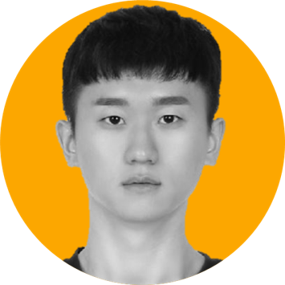

  <picture>
    <!-- Dark mode -->
    <source media="(prefers-color-scheme: dark)" srcset="image/muse-eum-white.png" />
    <!-- Light mode -->
    <source media="(prefers-color-scheme: light)" srcset="image/muse-eum-black.png" />
    <!-- Fallback -->
    
  </picture>

<h3 align="center">K-POP 아티스트와 팬들의 1:1 영상 팬사인회를 제공하는 몰입형 비대면 팬미팅 플랫폼, 뮤즈이음(MUSEːEUM)</h3>

**참여인원**: 6명  
**수행기간**: 2025. 07. 07 - 2025. 08. 22 (7주)  
**수행배경**: 삼성청년SW·AI아카데미 13기 공통프로젝트 (웹기술)

---

## Our Team

<table>
  <tr>
    <td width="25%" align="center">
       
      <strong>박지현 / FE</strong> 
      팀장 아카이브 화면·디자인
    </td>
    <td width="25%" align="center">
       
      <strong>김동규 / FE</strong> 
      회원관리 화면 채팅기능 연동
    </td>
    <td width="25%" align="center">
       
      <strong>남다현 / FE</strong> 
      대기실 화면 영상통화 화면
    </td>
  </tr>
</table>

<table>
  <tr>
    <td width="25%" align="center">
       
      <strong>김나경 / BE</strong> 
      인프라 / CI·CD  아카이브·행사·대본·STT
    </td>
    <td width="25%" align="center">
       
      <strong>박신영 / BE</strong> 
      OpenVidu 영상통화 Redis·SSE
    </td>
    <td width="25%" align="center">
       
      <strong>정필교 / BE</strong> 
      Spring Security  Web Socket·Chatbot
    </td>
  </tr>
</table>

---

## Highlight Film

---

## Key Features

1. 메인페이지  
   

2. 로그인  
   

3. 이벤트  
     
   

4. 영상통화  
   

5. 실시간 기념촬영  
   

6. 포토북  
   

---

## Video Call Algorithm

---

## System Architecture

---

## ERD

---

## Collaboration

| 구분                 | 툴        |
| -------------------- | --------- |
| **프로젝트 관리**    | JIRA      |
| **문서/회의**        | Notion    |
| **디자인/프로토타입**| Figma     |
| **팀 커뮤니케이션**  | Mattermost|
